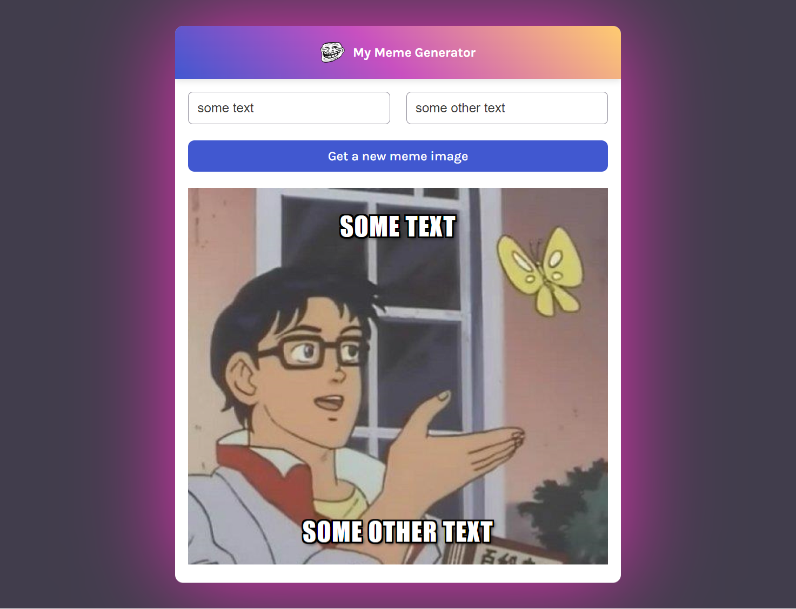

# VueJS meme generator

The project is to build a form that generate a meme with image and text.
It is bootstraped with Vite.js.

🔗 **Live preview:** [here](https://lambent-madeleine-608e47.netlify.app/)

### Screenshot

## Built with

### Technologies

- HTML
- CSS
- Vue JS

### Tools

- Vite

## Features

- Simple one page app with form

## What I learned

- Better knowledge of **Vue JS**.
- Convert React App to Vue App

## Author

👤 **Edouard Desgrée**

- GitHub: [edesgree](https://github.com/edesgree)

#### Created while working on the [The Odin Project](https://www.theodinproject.com/) and a [scrimba](https://scrimba.com/) class
